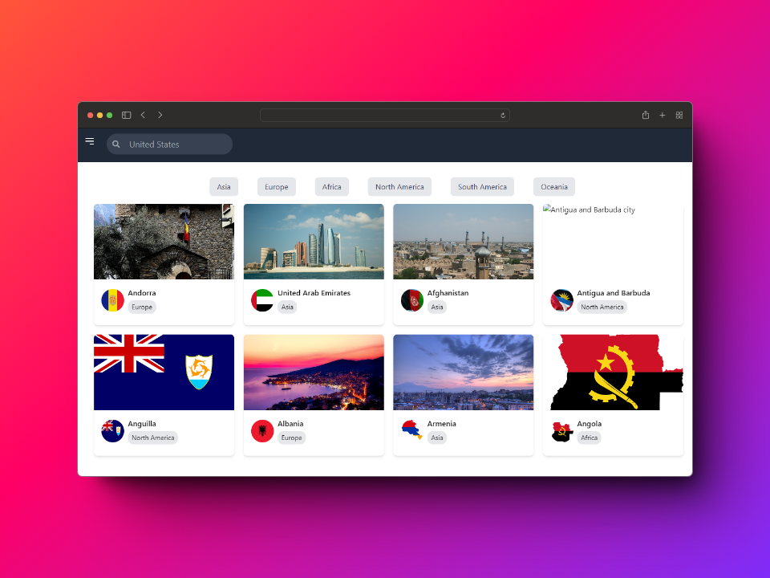
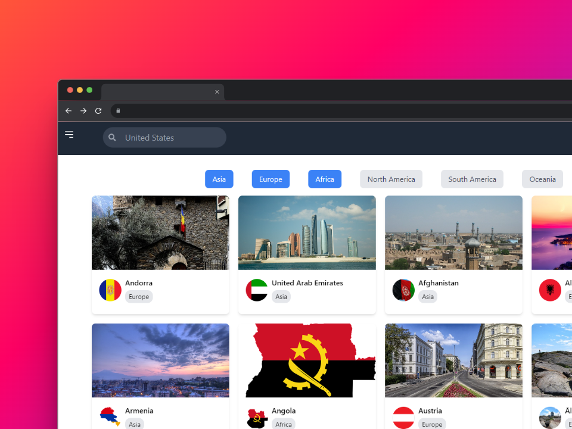
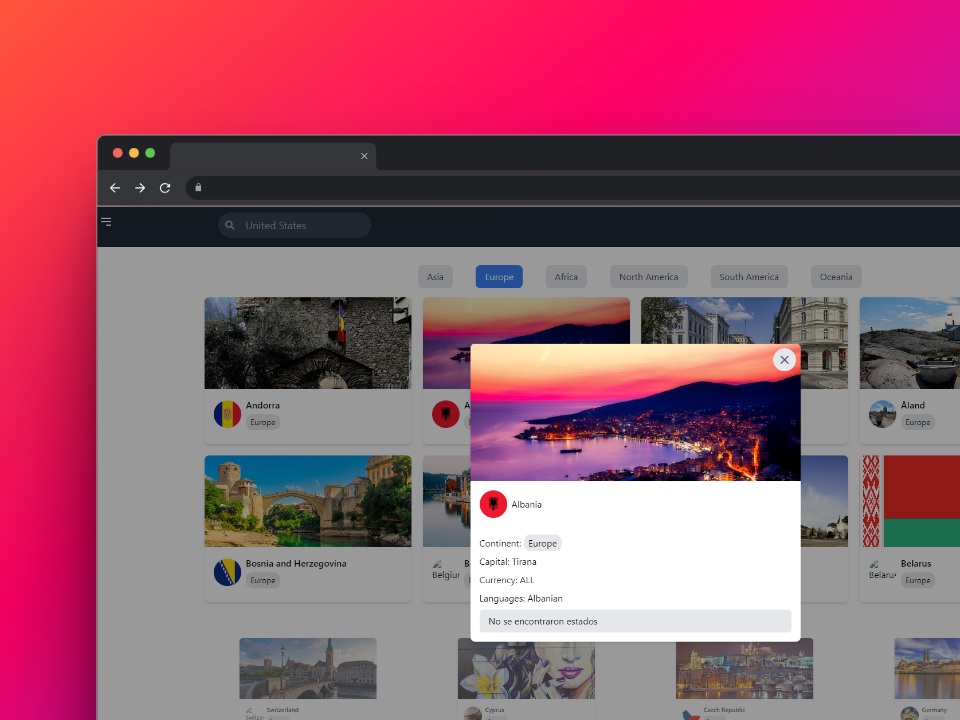
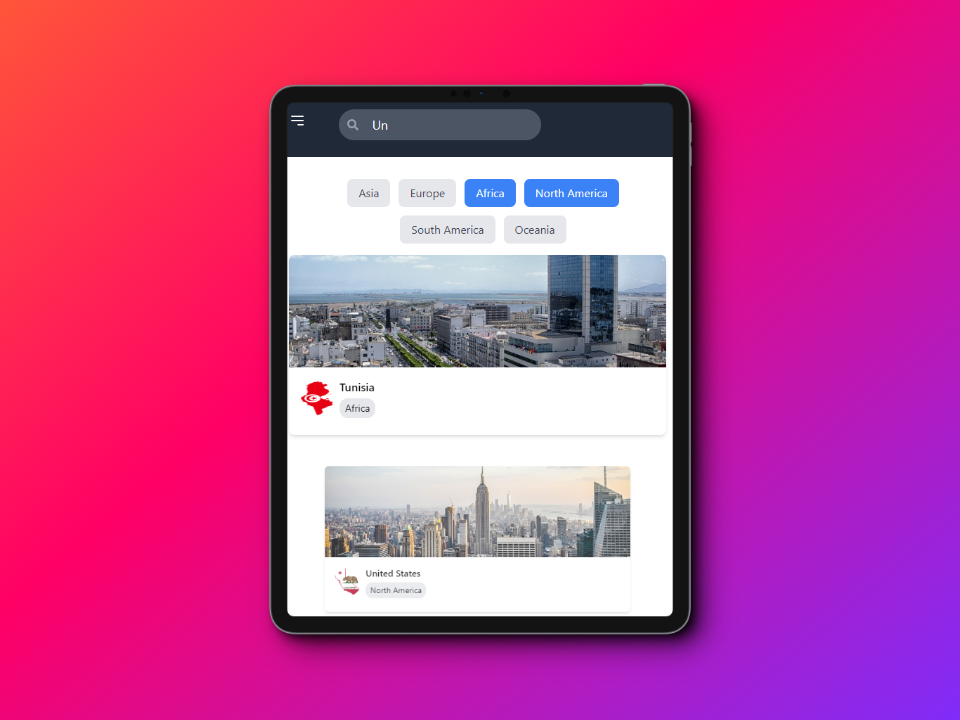

# Proyecto: Explorador de Países

## Objetivo

El objetivo principal de este proyecto es desarrollar una interfaz de usuario interactiva que permita a los usuarios explorar información detallada sobre países y continentes utilizando datos proporcionados por un API GraphQL.

## Descripción

Este proyecto se enfoca en la creación de una aplicación web que utiliza datos de un API GraphQL para mostrar información sobre países y continentes. La interfaz de usuario ofrece funcionalidades como búsqueda de países por nombre, filtrado por continente y visualización detallada de cada país.

## Tecnologías Utilizadas

- ViteJS con React: Framework utilizado para la construcción del proyecto.
- Tailwind CSS: Framework de estilos utilizado para el diseño y la maquetación.
- GraphQL: Utilizado para obtener datos sobre países y continentes desde el API proporcionado.
- Vercel: Plataforma utilizada para el despliegue de la aplicación.

## Requisitos Cumplidos

- Utilización de ViteJS con React como framework principal.
- Implementación de Tailwind CSS para el diseño y maquetación responsiva.
- Uso de Apollo Client para realizar consultas GraphQL al API de países.
- Funcionalidad de búsqueda por nombre de país.
- Implementación de filtrado por continente.
- Visualización detallada de la información de un país al seleccionarlo.

## Estructura del Proyecto

- **src/**
  - Contiene el código fuente del proyecto.
- **public/**
  - Archivos estáticos utilizados en el proyecto.
- **deploy/**
  - Archivos o configuraciones específicos para el despliegue en Vercel.

## Instrucciones de Instalación

1. Clona el repositorio del proyecto.
2. Instala las dependencias utilizando el gestor de paquetes npm o yarn.
3. Ejecuta el proyecto localmente con los comandos adecuados.

## Instrucciones de Uso

1. Abre la aplicación en un navegador.

2. Explora los países utilizando la barra de búsqueda o el filtrado por continente.

3. Selecciona un país para ver detalles específicos.

## Enlaces

- Repositorio del Proyecto: [Enlace al Repositorio](https://github.com/ysaacnoa/Prueba-tecnica.git)
- Aplicación Desplegada: [Enlace a la Aplicación](https://prueba-tecnica-vercel.vercel.app/)

## Capturas de Pantalla

---
